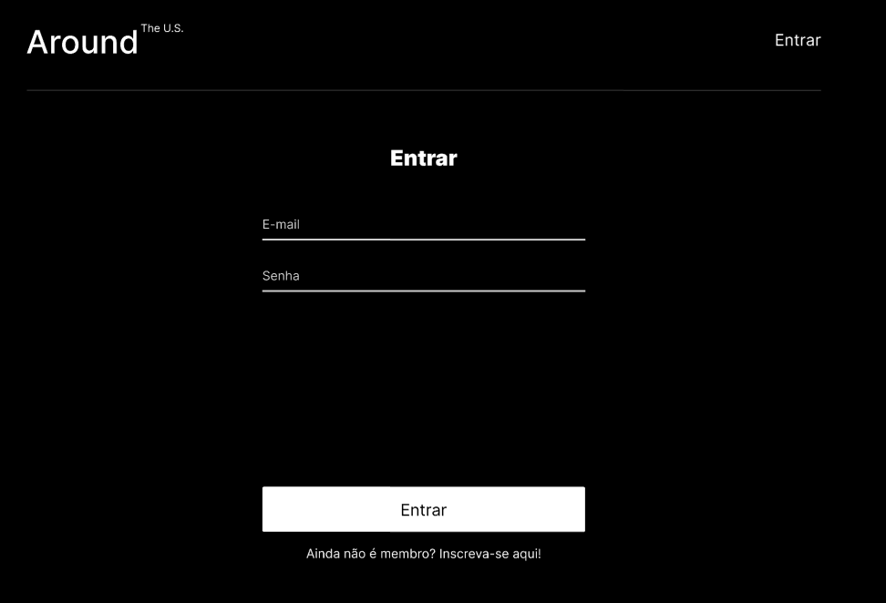

# Projeto: EUA Afora

## Visão geral

Este projeto é uma página protótipo de uma rede social onde os usuários podem compartilhar seus hobbies, nome de usuário, cards sobre suas histórias e editar essas informações. O projeto começou com implementação inicial utilizando HTML, CSS e JS, e foi convertido para biblioteca React para aprimoramento do desenvolvimento com autenticação com JWT, o projeto contará com melhorias futuras conforme forem pertinentes.

## Projeto em HTML, CSS e JS Inicial

* [Compare :D](https://github.com/dlaranjeirasilva/web_project_4_ptbr/tree/main)

## Recursos

#### React

Uma biblioteca JavaScript para construir interfaces de usuário. O React permite criar componentes reutilizáveis e atualizar eficientemente a interface do usuário em resposta a mudanças de estado.

#### React-DOM

Uma biblioteca que fornece métodos específicos para manipular o DOM (Document Object Model) em aplicativos React. Ele é usado para renderizar os componentes React em um navegador.

#### React-Router-DOM

Uma biblioteca que facilita a navegação entre diferentes partes de um aplicativo React. Ele permite definir rotas para diferentes URLs e renderizar os componentes correspondentes quando essas rotas são acessadas.

#### React-Scripts

Um conjunto de scripts pré-configurados para iniciar, construir e testar aplicativos React. Ele fornece comandos convenientes, como `start` para iniciar um servidor de desenvolvimento, `build` para criar uma versão otimizada para produção e `test` para executar testes automatizados.

#### Web-Vitals

Uma biblioteca que fornece métricas essenciais de desempenho da web, como tempo de carregamento da página, tempo de interatividade e outras. Essas métricas são úteis para medir e melhorar a experiência do usuário em um site ou aplicativo da web.

## Figma

* [Link para o projeto no Figma (Estrutura inicial)](https://www.figma.com/file/XfB6BSINvliub43JgKza1e/WEB.-Sprint-4.-Around-The-U.S.-desktop-%2B-mobile-pt)

* [Link para o projeto no Figma (Estrutura com autenticação)](https://www.figma.com/file/YrtMoHGfwML1yeN5DfWEq3/Web_Brief_Sprint_15_PT-%7C-Registro-e-autoriza%C3%A7%C3%A3o?type=design&node-id=1-157&mode=design&t=t3fNJ0CGnNSMVhWP-0)

## Capturas de tela

## Licença

Este projeto está sob a licença [ISC](https://pt.wikipedia.org/wiki/Licen%C3%A7a_ISC).
